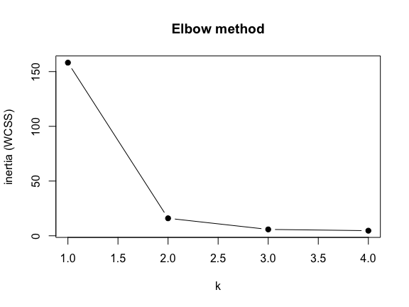
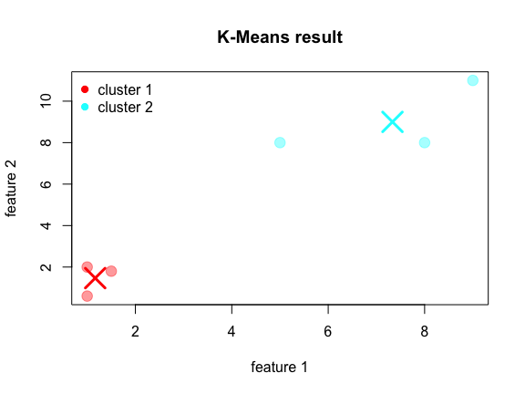
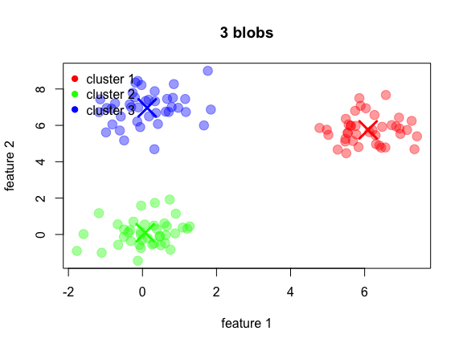
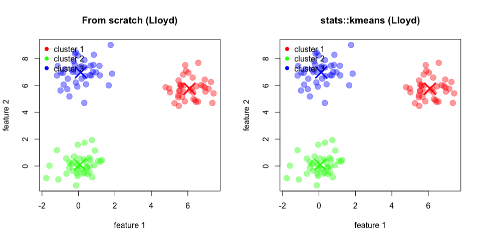

K-Means from Scratch, in Base R
================

# Introduction

**What the algorithm does?** You give it points and a number `k`; it
splits the points into `k` groups so that points in a group sit close
together. No labels, just geometry.

**What it minimizes? `inertia`.** Also called *within-cluster sum of
squares* (WCSS): for every point, take the **squared** distance to its
own cluster’s center, and add all of them up. Small inertia = tight
clusters. Finding the grouping with the globally smallest inertia is
NP-hard, so K-Means doesn’t try. It uses **Lloyd’s algorithm**, a
heuristic that finds a *good* answer (a local minimum):

1.  **Guess** `k` starting centroids.
2.  **Assign** each point to its nearest centroid.
3.  **Update** each centroid to the mean of its assigned points.
4.  **Repeat** 2-3; **stop** when the centroids stop moving.

Each assign+update cycle can only lower inertia or leave it unchanged
(never raise it), and inertia can’t go below 0 — so the loop must
settle. It just isn’t guaranteed to settle on the *best* possible
answer, which is why initialization matters.

> **Key Takeaway:**
>
> I.) K-Means trades the impossible goal of finding the absolute best
> clustering for the practical goal of finding a good enough clustering
> fast. It uses math that always moves downhill, so it’s guaranteed to
> converge—just not to the global optimum.
>
> II.) Always scale your features before K-means. K-means uses Euclidean
> distance, which is blind to feature ranges—so a feature with range
> 0-1,000,000 will completely dominate one with range 18-80, causing you
> to cluster on accident using mostly just that one variable.

# The worked example

Every step below runs on the same 6 points, so you can check numbers by
hand.

``` r
X <- matrix(c(
  1.0,  2.0,
  1.5,  1.8,
  5.0,  8.0,
  8.0,  8.0,
  1.0,  0.6,
  9.0, 11.0
), ncol = 2, byrow = TRUE)

k <- 2
print(X)
#>      [,1] [,2]
#> [1,]  1.0  2.0
#> [2,]  1.5  1.8
#> [3,]  5.0  8.0
#> [4,]  8.0  8.0
#> [5,]  1.0  0.6
#> [6,]  9.0 11.0
```

For the hand-walkthrough we start the centroids (randomly) on two of the
data points themselves: `(1.0, 2.0)` (row 1) and `(5.0, 8.0)` (row 3).

``` r
centroids_start <- matrix(c(
  1.0, 2.0,
  5.0, 8.0
), ncol = 2, byrow = TRUE)

centroids_start
#>      [,1] [,2]
#> [1,]    1    2
#> [2,]    5    8
```

# Step 0 — the distance metric

K-Means uses **squared Euclidean distance**: subtract feature by
feature, square, sum.

$$
d(a, b)^2 = (a_1 - b_1)^2 + (a_2 - b_2)^2 + \dots + (a_n - b_n)^2
$$

Example, rows 1 and 2: differences `-0.5` and `0.2` → squares `0.25` and
`0.04` → sum `0.29` → distance `sqrt(0.29) = 0.539`.

**Why squared, and why this matters later:** the arithmetic **mean** is
the unique point that minimizes the sum of squared Euclidean distances
to a set of points (take the derivative of the sum of squares, set it to
zero, the mean falls out). So “squared Euclidean distance” and “update =
take the mean” are a *matched pair*, not two free choices.

**Practical consequence:** standardize your features first (`scale(X)`),
or a feature measured in thousands will drown out one measured in single
digits.

``` r
euclidean <- function(a, b) {
  total <- 0
  for (d in seq_along(a)) {
    total <- total + (a[d] - b[d])^2
  }
  sqrt(total)
}

# check: rows 1 and 2 -> 0.5385165
euclidean(X[1, ], X[2, ])
#> [1] 0.5385165
```

# Step 1 — `compute_distances`: every point to every centroid

Two nested loops fill an `n x k` matrix: row `i` = point `i`, column `j`
= centroid `j`.

**→ feeds Step 2**, which only needs to find the smallest value in each
row.

``` r
compute_distances <- function(X, centroids) {
  n <- nrow(X)
  k <- nrow(centroids)
  distances <- matrix(0, nrow = n, ncol = k)

  for (i in seq_len(n)) {          # each point
    for (j in seq_len(k)) {        # each centroid
      distances[i, j] <- euclidean(X[i, ], centroids[j, ])
    }
  }
  distances
}

D <- compute_distances(X, centroids_start)
print(round(D, 3))
#>        [,1]  [,2]
#> [1,]  0.000 7.211
#> [2,]  0.539 7.120
#> [3,]  7.211 0.000
#> [4,]  9.220 3.000
#> [5,]  1.400 8.412
#> [6,] 12.042 5.000
```

Row 1 is `0.000` in column 1 because point 1 is centroid 1. Row 3 is the
mirror image.

# Step 2 — `assign_clusters`: nearest centroid wins

Scan each row, keep the index of the smallest distance. Assignment is
hard: a point belongs 100% to exactly one cluster, never shared.

**← takes** the matrix from Step 1. **→ feeds Step 3**, which averages
the points of each label.

``` r
assign_clusters <- function(distances) {
  n <- nrow(distances)
  k <- ncol(distances)
  labels <- integer(n)

  for (i in seq_len(n)) {
    best <- 1                            # assume centroid 1 is closest...
    for (j in seq_len(k)) {              # ...then try to beat it
      if (distances[i, j] < distances[i, best]) best <- j
    }
    labels[i] <- best
  }
  labels
}

labels <- assign_clusters(D)
print(labels)
#> [1] 1 1 2 2 1 2
```

Row 4 is `[9.220, 3.000]` → picks cluster 2, because `3.0 < 9.220`.

# Step 3 — `update_centroids`: move each center to its cluster’s mean

Sum the points carrying each label, divide by the count. This is the
“mean-square” step from Step 0: the mean is exactly the point that
minimizes the sum of squared distances inside the cluster, so this move
can only lower inertia.

**Corner case — empty cluster.** If no point got label `j`, the mean
would be `0/0 = NaN` and poison every later iteration. Keep the old
centroid instead.

**← takes** the labels from Step 2. **→ feeds Step 1 again** on the next
iteration.

``` r
update_centroids <- function(X, labels, centroids, k) {
  n <- nrow(X)
  p <- ncol(X)
  new_centroids <- matrix(0, nrow = k, ncol = p)

  for (j in seq_len(k)) {
    total <- rep(0, p)
    count <- 0

    for (i in seq_len(n)) {              # collect the points of cluster j
      if (labels[i] == j) {
        total <- total + X[i, ]
        count <- count + 1
      }
    }

    if (count == 0) {
      new_centroids[j, ] <- centroids[j, ]   # empty cluster -> freeze it
    } else {
      new_centroids[j, ] <- total / count    # the mean
    }
  }
  new_centroids
}

centroids_new <- update_centroids(X, labels, centroids_start, k)
print(round(centroids_new, 4))
#>        [,1]   [,2]
#> [1,] 1.1667 1.4667
#> [2,] 7.3333 9.0000
```

Empty-cluster check — force every point into cluster 2 and confirm
centroid 1 is left untouched rather than becoming `NaN`:

``` r
print(update_centroids(X, rep(2, nrow(X)), centroids_start, k))
#>      [,1]     [,2]
#> [1,] 1.00 2.000000
#> [2,] 4.25 5.233333
```

# Step 4 — `compute_inertia`: the number being minimized

Sum of **squared** distances from each point to *its own* centroid. This
is the scoreboard: it tells you whether an iteration actually improved
anything.

**← takes** labels (Step 2) and centroids (Step 3). **→ feeds** the
convergence check and the elbow method.

``` r
compute_inertia <- function(X, labels, centroids) {
  inertia <- 0
  for (i in seq_len(nrow(X))) {
    j <- labels[i]                                   # this point's own cluster
    inertia <- inertia + euclidean(X[i, ], centroids[j, ])^2
  }
  inertia
}

# before the update (centroids still on the starting guess)
compute_inertia(X, labels, centroids_start)
#> [1] 36.25

# after the update
compute_inertia(X, labels, centroids_new)
#> [1] 15.98
```

Expected `36.25` then `15.98`. Moving the centroids to the cluster means
dropped inertia by more than half without touching a single assignment —
that is the mean-square property paying off.

Breakdown of the `36.25`: cluster 1 contributes
`0^2 + 0.539^2 + 1.4^2 = 2.25`, cluster 2 contributes
`0^2 + 3^2 + 5^2 = 34.0`.

# Step 5 — one full iteration, by hand

Steps 1→2→3→4 chained once, then again, so you can watch the numbers
move before hiding them inside a loop.

``` r
centroids_iter <- centroids_start

for (iteration in 1:3) {
  D_i       <- compute_distances(X, centroids_iter)              # step 1
  labels_i  <- assign_clusters(D_i)                              # step 2
  moved     <- update_centroids(X, labels_i, centroids_iter, k)  # step 3
  inertia_i <- compute_inertia(X, labels_i, moved)               # step 4

  cat("iteration", iteration, "\n")
  cat("  labels  :", labels_i, "\n")
  cat("  centroids:", round(as.vector(t(moved)), 4), "\n")
  cat("  inertia :", round(inertia_i, 4), "\n")

  centroids_iter <- moved                                        # -> back to step 1
}
#> iteration 1 
#>   labels  : 1 1 2 2 1 2 
#>   centroids: 1.1667 1.4667 7.3333 9 
#>   inertia : 15.98 
#> iteration 2 
#>   labels  : 1 1 2 2 1 2 
#>   centroids: 1.1667 1.4667 7.3333 9 
#>   inertia : 15.98 
#> iteration 3 
#>   labels  : 1 1 2 2 1 2 
#>   centroids: 1.1667 1.4667 7.3333 9 
#>   inertia : 15.98
```

Iteration 1 moves the centroids and lands on inertia `15.98`. Iterations
2 and 3 produce the **same** labels and the **same** centroids: nothing
moves, inertia is flat. That standstill is convergence, and it’s what
the loop below detects automatically.

# Step 6 — initialization

Lloyd’s algorithm only ever *refines* a starting guess; it never
explores elsewhere. A bad guess locks in a bad answer.

**`random`** — pick `k` distinct data points at random. Simple, but
randomness has no sense of “spread out”: two picks can land in the same
dense blob, leaving another real cluster with no centroid.

**`k-means++`** — spread the picks out, using the data itself:

1.  First centroid: one random point.
2.  For every point, compute the squared distance to its *nearest*
    chosen centroid (the minimum, not the sum).
3.  Turn those into probabilities by dividing by their total — a point
    4x farther is 4x more likely.
4.  Sample the next centroid from that distribution. Weighted *random*,
    not “grab the farthest point”, so a single outlier doesn’t get
    picked deterministically every run.
5.  Repeat until you have `k`.

Squared distances are used as weights for the same reason they’re used
everywhere else here: they exaggerate large gaps, so genuinely far-away
regions dominate the draw.

**→ feeds** the first call of Step 1 inside `fit`.

``` r
init_centroids <- function(X, k, init = "k-means++", seed = NULL) {
  if (!is.null(seed)) set.seed(seed)
  n <- nrow(X)

  if (init == "random") {
    idx <- sample(seq_len(n), k)             # without replacement
    return(X[idx, , drop = FALSE])           # drop=FALSE keeps it a matrix when k==1
  }

  # ---- k-means++ ----
  centroids <- matrix(0, nrow = k, ncol = ncol(X))
  centroids[1, ] <- X[sample(seq_len(n), 1), ]         # 1. first pick is blind

  j <- 2
  while (j <= k) {
    d2 <- numeric(n)

    for (i in seq_len(n)) {                            # 2. distance to NEAREST chosen centroid
      nearest <- Inf
      for (m in seq_len(j - 1)) {
        dist2 <- euclidean(X[i, ], centroids[m, ])^2
        if (dist2 < nearest) nearest <- dist2
      }
      d2[i] <- nearest
    }

    if (sum(d2) == 0) {                                # all points identical
      probs <- rep(1 / n, n)
    } else {
      probs <- d2 / sum(d2)                            # 3. squared distance -> probability
    }

    centroids[j, ] <- X[sample(seq_len(n), 1, prob = probs), ]   # 4. weighted draw
    j <- j + 1
  }
  centroids
}

init_centroids(X, k = 2, init = "k-means++", seed = 42)
#>      [,1] [,2]
#> [1,]    1    2
#> [2,]    5    8
```

Run it a few times with different seeds: `k-means++` almost always puts
one centroid in each blob, while `random` regularly puts both in the
same one.

``` r
for (s in 1:4) {
  cat("seed", s, "| random   :", round(as.vector(t(init_centroids(X, 2, "random",    seed = s))), 2), "\n")
  cat("seed", s, "| kmeans++ :", round(as.vector(t(init_centroids(X, 2, "k-means++", seed = s))), 2), "\n")
}
#> seed 1 | random   : 1 2 8 8 
#> seed 1 | kmeans++ : 1 2 9 11 
#> seed 2 | random   : 1 0.6 1 2 
#> seed 2 | kmeans++ : 1 0.6 8 8 
#> seed 3 | random   : 1 0.6 1.5 1.8 
#> seed 3 | kmeans++ : 1 0.6 5 8 
#> seed 4 | random   : 5 8 9 11 
#> seed 4 | kmeans++ : 5 8 1 0.6
```

# Step 7 — `fit`: the whole loop

Everything above, wired together:

`init_centroids` → **repeat** \[ `compute_distances` → `assign_clusters`
→ `update_centroids` → `compute_inertia` \] **until** the centroids stop
moving.

**Stopping rule.** Measure how far the farthest centroid moved this
iteration; if that shift is below `tol`, we’ve converged. `max_iter` is
a safety cap so a pathological case can’t spin forever.

The trace prints the two things worth watching per iteration:
**inertia** (must never go up) and **max centroid shift** (must trend to
0).

``` r
fit <- function(X, k, init = "k-means++", max_iter = 100, tol = 1e-4,
                seed = NULL, verbose = TRUE) {

  centroids <- init_centroids(X, k, init, seed)     # the guess
  history   <- numeric(0)
  labels    <- integer(nrow(X))
  inertia   <- NA
  n_iter    <- 0

  for (iteration in seq_len(max_iter)) {
    n_iter <- iteration

    D             <- compute_distances(X, centroids)                  # 1. assign phase
    labels        <- assign_clusters(D)
    new_centroids <- update_centroids(X, labels, centroids, k)        # 2. update phase

    shift <- 0                                                        # 3. how far did centers move?
    for (j in seq_len(k)) {
      moved <- euclidean(new_centroids[j, ], centroids[j, ])
      if (moved > shift) shift <- moved
    }

    centroids <- new_centroids
    inertia   <- compute_inertia(X, labels, centroids)                # 4. scoreboard
    history   <- c(history, inertia)

    if (verbose) {
      cat(sprintf("iter %2d | inertia = %10.4f | max centroid shift = %.6f\n",
                  iteration, inertia, shift))
    }

    if (shift <= tol) break                                           # 5. converged
  }

  list(centroids = centroids, labels = labels, inertia = inertia,
       n_iter = n_iter, history = history)
}

result <- fit(X, k = 2, init = "k-means++", seed = 42)
#> iter  1 | inertia =    15.9800 | max centroid shift = 2.538591
#> iter  2 | inertia =    15.9800 | max centroid shift = 0.000000
result
#> $centroids
#>          [,1]     [,2]
#> [1,] 1.166667 1.466667
#> [2,] 7.333333 9.000000
#> 
#> $labels
#> [1] 1 1 2 2 1 2
#> 
#> $inertia
#> [1] 15.98
#> 
#> $n_iter
#> [1] 2
#> 
#> $history
#> [1] 15.98 15.98
```

On this data it converges in 2-3 iterations to centroids
`(1.1667, 1.4667)` and `(7.3333, 9.0)`, labels splitting the two blobs,
inertia `15.98`. The final iteration exists only to *prove* nothing
changed — its shift is `0`. If a run lands somewhere else, that’s
exactly the initialization sensitivity from Step 6; try another seed.

Sanity check that should hold on any dataset: `history` is
non-increasing.

``` r
result$history
#> [1] 15.98 15.98

all(diff(result$history) <= 1e-9)   # inertia never goes up
#> [1] TRUE
```

# Step 8 — choosing `k`: the elbow method

Run `fit` for each candidate `k` and record the final inertia.

**The nuance:** inertia *always* decreases as `k` grows — at `k = n`
every point is its own cluster and inertia is exactly 0. So you never
pick the `k` with the lowest inertia. You look for the **elbow**: the
point after which extra clusters buy you only a small improvement.

**← uses** `fit` (Step 7) and its inertia (Step 4).

``` r
elbow_method <- function(X, k_values, ...) {
  inertias <- numeric(length(k_values))
  for (i in seq_along(k_values)) {
    res <- fit(X, k_values[i], verbose = FALSE, ...)
    inertias[i] <- res$inertia
  }
  inertias
}

k_values <- 1:4
inertias <- elbow_method(X, k_values, seed = 42)
round(inertias, 2)
#> [1] 158.15  15.98   5.81   4.64
```

``` r
plot(k_values, inertias, type = "b", pch = 19,
     xlab = "k", ylab = "inertia (WCSS)", main = "Elbow method")
```

<div class="figure" style="text-align: center">


<p class="caption">
Inertia against k — the elbow sits at k = 2.
</p>

</div>

You should see roughly `158.15, 15.98, 5.81, ...`. The collapse from
`k=1` to `k=2` is enormous; after that the gains are small — the elbow
is at **k = 2**, which matches the two visible blobs.

(The `k=3` and `k=4` values depend on where initialization landed; rerun
with different seeds and they’ll wobble. `k=1` and `k=2` won’t.)

# Step 9 — `silhouette_score`: a quantitative alternative

Eyeballing an elbow is subjective. The silhouette measures, per point
`i`:

- **a(i)** — average distance to the *other* points in its own cluster
  (cohesion).
- **b(i)** — average distance to all points of the *nearest other*
  cluster (separation).
- **s(i)** = `(b - a) / max(a, b)`, in `[-1, 1]`.

`s(i)` near **1** = comfortably in the right cluster; near **0** =
sitting on a border; **negative** = closer on average to another cluster
than to its own, i.e. probably misassigned. The score is the mean of all
`s(i)`. Compute it for several `k` and take the highest.

Note it uses *plain* distances between points, not squared distances to
centroids — it’s a different question from inertia.

``` r
silhouette_score <- function(X, labels) {
  n        <- nrow(X)
  clusters <- sort(unique(labels))
  s        <- numeric(n)

  for (i in seq_len(n)) {

    # a(i): mean distance to the other members of my own cluster
    same_total <- 0
    same_count <- 0
    for (j in seq_len(n)) {
      if (j != i && labels[j] == labels[i]) {
        same_total <- same_total + euclidean(X[i, ], X[j, ])
        same_count <- same_count + 1
      }
    }

    if (same_count == 0) {          # alone in its cluster -> undefined, score it 0
      s[i] <- 0
      next
    }
    a <- same_total / same_count

    # b(i): mean distance to the closest OTHER cluster
    b <- Inf
    for (cl in clusters) {
      if (cl == labels[i]) next
      other_total <- 0
      other_count <- 0
      for (j in seq_len(n)) {
        if (labels[j] == cl) {
          other_total <- other_total + euclidean(X[i, ], X[j, ])
          other_count <- other_count + 1
        }
      }
      if (other_count > 0) {
        avg <- other_total / other_count
        if (avg < b) b <- avg
      }
    }

    s[i] <- if (is.finite(b)) (b - a) / max(a, b) else 0
  }

  mean(s)
}

round(silhouette_score(X, result$labels), 4)
#> [1] 0.748
```

Expected `0.748`. Point 1 for instance has `a = 0.969` (its own blob is
tight) and `b = 9.491` (the other blob is far), giving `s = 0.898`.

# Step 10 — plotting

``` r
plot_clusters <- function(X, labels, centroids, main = "K-Means result") {

  # Define one color per cluster
  cluster_colors <- rainbow(nrow(centroids))

  # Add transparency to the cluster colors
  transparent_colors <- adjustcolor(cluster_colors, alpha.f = 0.4)

  plot(X[, 1], X[, 2],
       col = transparent_colors[labels],
       pch = 19, cex = 1.6,
       xlab = "feature 1",
       ylab = "feature 2",
       main = main)

  # Centroids stay fully opaque
  points(centroids[, 1], centroids[, 2],
         col = cluster_colors,
         pch = 4, cex = 3, lwd = 3)

  legend("topleft",
         legend = paste("cluster", seq_len(nrow(centroids))),
         col = cluster_colors,
         pch = 19,
         bty = "n")
}
```

``` r
plot_clusters(X, result$labels, result$centroids)
```

<div class="figure" style="text-align: center">


<p class="caption">
The 6-point example: crosses mark the final centroids.
</p>

</div>

# Step 11 — a bigger, less hand-checkable test

Three synthetic blobs with known centers. If the implementation is
right, the recovered centroids land close to `(0,0)`, `(6,6)`, `(0,7)`
(in some order) and the silhouette is high.

``` r
set.seed(1)
make_blob <- function(n, cx, cy, sd = 0.8) {
  cbind(rnorm(n, cx, sd), rnorm(n, cy, sd))
}
X_big <- rbind(make_blob(40, 0, 0),
               make_blob(40, 6, 6),
               make_blob(40, 0, 7))

res_big <- fit(X_big, k = 3, init = "k-means++", seed = 7, verbose = FALSE)

round(res_big$centroids, 2)
#>      [,1] [,2]
#> [1,] 6.09 5.75
#> [2,] 0.07 0.10
#> [3,] 0.13 6.96
cat("iterations:", res_big$n_iter, "| inertia:", round(res_big$inertia, 2),
    "| silhouette:", round(silhouette_score(X_big, res_big$labels), 3), "\n")
#> iterations: 2 | inertia: 137.74 | silhouette: 0.781
```

``` r
plot_clusters(X_big, res_big$labels, res_big$centroids, main = "3 blobs")
```

<div class="figure" style="text-align: center">


<p class="caption">
Three recovered blobs.
</p>

</div>

Compare `k = 2..5` on the same data using both criteria:

``` r
for (kk in 2:5) {
  r <- fit(X_big, kk, seed = 7, verbose = FALSE)
  cat(sprintf("k=%d  inertia=%8.2f  silhouette=%.3f\n",
              kk, r$inertia, silhouette_score(X_big, r$labels)))
}
#> k=2  inertia=  879.01  silhouette=0.601
#> k=3  inertia=  137.74  silhouette=0.781
#> k=4  inertia=  115.00  silhouette=0.638
#> k=5  inertia=  100.78  silhouette=0.477
```

Inertia keeps falling as `k` rises; the silhouette peaks at `k = 3` and
then drops. That is the difference between the two criteria in one
table.

``` r
best <- NULL
for (s in 1:10) {
  candidate <- fit(X_big, k = 3, seed = s, verbose = FALSE)
  if (is.null(best) || candidate$inertia < best$inertia) best <- candidate
}
cat("best inertia over 10 restarts:", round(best$inertia, 4), "\n")
#> best inertia over 10 restarts: 137.7445
```

# Step 12 — sanity check against `stats::kmeans`

**Align the labels.** Cluster IDs are arbitrary names, not meaningful
values — our cluster 1 may be R’s cluster 3. Testing
`labels == km$cluster` directly would report ~33% agreement on a
*perfect* match. We first map each library centroid to its nearest
centroid of ours, then relabel.

Both sides are scored with our own `silhouette_score`, so the measuring
stick is identical and any difference is real rather than definitional.

``` r
set.seed(7)
km <- kmeans(X_big, centers = 3, algorithm = "Lloyd",
             iter.max = 100, nstart = 1)

# --- align R's cluster IDs to ours: each km centroid -> nearest of our centroids ---
align_labels <- function(their_centroids, our_centroids, their_labels) {
  k   <- nrow(their_centroids)
  map <- integer(k)
  for (j in seq_len(k)) {
    dists <- numeric(nrow(our_centroids))
    for (m in seq_len(nrow(our_centroids))) {
      dists[m] <- euclidean(their_centroids[j, ], our_centroids[m, ])
    }
    map[j] <- which.min(dists)                        # theirs j -> ours map[j]
  }
  if (anyDuplicated(map)) {
    warning("centroid matching is not one-to-one; the two runs found different solutions")
  }
  list(map = map, labels = map[their_labels])
}

al          <- align_labels(km$centers, res_big$centroids, km$cluster)
km_labels   <- al$labels
km_centroids <- km$centers[order(al$map), , drop = FALSE]

cat("centroid mapping (theirs -> ours):", al$map, "\n")
#> centroid mapping (theirs -> ours): 1 3 2
```

## Side by side

``` r
par(mfrow = c(1, 2))
plot_clusters(X_big, res_big$labels, res_big$centroids,
              main = "From scratch (Lloyd)")
plot_clusters(X_big, km_labels, km_centroids,
              main = "stats::kmeans (Lloyd)")
```

<div class="figure" style="text-align: center">


<p class="caption">
Left: our from-scratch Lloyd. Right: stats::kmeans, relabelled to our
cluster IDs.
</p>

</div>

``` r
par(mfrow = c(1, 1))
```

## The metrics table

``` r
max_centroid_gap <- max(sapply(seq_len(3), function(j)
  euclidean(res_big$centroids[j, ], km_centroids[j, ])))

comparison <- data.frame(
  metric = c("inertia (WCSS)",
             "iterations",
             "silhouette",
             "identical labels (%)",
             "max centroid gap"),
  from_scratch = c(round(res_big$inertia, 4),
                   res_big$n_iter,
                   round(silhouette_score(X_big, res_big$labels), 4),
                   NA, NA),
  stats_kmeans = c(round(km$tot.withinss, 4),
                   km$iter,
                   round(silhouette_score(X_big, km_labels), 4),
                   NA, NA),
  agreement = c(round(res_big$inertia - km$tot.withinss, 6),
                NA,
                NA,
                round(100 * mean(res_big$labels == km_labels), 2),
                signif(max_centroid_gap, 4)),
  stringsAsFactors = FALSE
)

knitr::kable(comparison,
             col.names = c("metric", "from scratch", "stats::kmeans", "difference / agreement"),
             caption = "Our Lloyd vs R's Lloyd on the same 120 points.")
```

| metric               | from scratch | stats::kmeans | difference / agreement |
|:---------------------|-------------:|--------------:|-----------------------:|
| inertia (WCSS)       |     137.7445 |      137.7445 |                      0 |
| iterations           |       2.0000 |        2.0000 |                     NA |
| silhouette           |       0.7808 |        0.7808 |                     NA |
| identical labels (%) |           NA |            NA |                    100 |
| max centroid gap     |           NA |            NA |                      0 |
